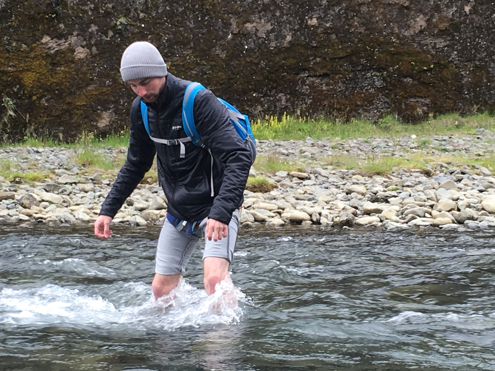

# Assignment: Introduction to GitHub and R

## 1. Name: William Skorski

> Add your name in the heading above.

## 2. Course Goals

1.  Learn R
2.  Branch out to more isotopic systems
3.  Better understand the mechanisms/pathways that fractionate isotopes

> List three goals you would like to accomplish through this class. This can be anything from things you'd like to know, skills you'd like to learn or improve, concepts you'd like to understand or apply, etc.
## 3. Something fun

> Add a picture of yourself doing something you enjoy outside school (hiking, cooking, playing music, reading, etc) to the [`images`](images) folder and link to it here with a descriptive title (for mouseover).

## 4. Top 5 soft to semi-soft cheeses

1.  Humboldt Fog
2.  Cambazola
3.  Midnight Moon/Beemster
4.  Burrata
5.  Truffle Tremor

## 5. Intro to R

> Go to [http://tryr.codeschool.com/](http://tryr.codeschool.com/) and complete lessons 1-4. For each of the lessons, answer the following questions:

### 5.1 What is the output of the last command in chapter 1?
Will ye be my pen pal?

### 5.2 What is the output of the last command in chapter 2?
20

### 5.3 What kind of plot is produced by the last command in chapter 3?
A heat map of a volcano in New Zealand

### 5.4 What kinds of plot feature is added by the last command in chapter 4?
A line showing one standard deviation below the mean
